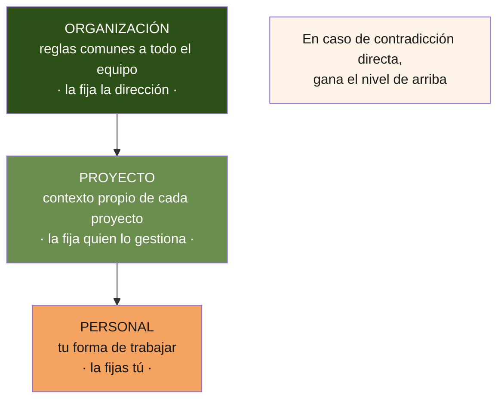
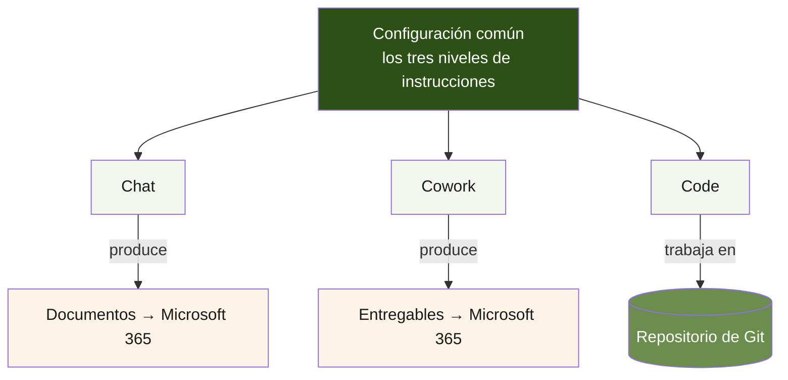

# Anexo C · Claude Team: cómo funciona y cómo se configura

**Anexo del documento troncal *Entornos de trabajo*.**
Aplicable a todo el equipo. Explica qué es Claude Team, en qué se diferencia del Claude que quizá hayáis usado a título individual, y cómo configurar tu espacio para que trabaje bien. Para la visión de conjunto de los entornos, ver el documento troncal.

---

## 1. Qué es Claude Team y en qué se diferencia del individual

Muchos habréis usado Claude a título personal, en una cuenta gratuita o de pago. Claude Team es distinto en una cosa esencial: **es un espacio compartido de la empresa, con configuración común y trabajo organizado por proyectos.** No es "el mismo Claude con más mensajes"; es un entorno de trabajo de equipo.

Las diferencias que importan en el día a día:

**Hay configuración que ya viene puesta.** En Claude individual, cada conversación empieza en blanco y tú le explicas todo. En Claude Team, la empresa ha fijado unas reglas comunes (idioma, tono, cómo fundamentar, qué no hacer) que se aplican solas en todas tus conversaciones. No tienes que configurarlas ni puedes saltártelas: son el estándar de la casa.

**El trabajo se organiza en proyectos.** Un proyecto es un espacio dentro de Claude Team con su propio contexto, sus propios documentos de referencia y sus propias instrucciones. Trabajar dentro del proyecto correcto hace que Claude sepa de qué va lo que haces sin que se lo expliques cada vez.

**Lo que hagas puede ser compartido.** Según cómo esté configurado un proyecto, tus conversaciones y hallazgos pueden ser visibles para el equipo. Es una herramienta de trabajo común, no un cuaderno privado.

**Es más capaz en tareas largas.** Además del chat, Claude Team incluye superficies para trabajo de varios pasos y para trabajo sobre código, que la sección 3 explica.

---

## 2. Los tres niveles de instrucciones

Claude Team recibe su contexto en tres niveles, con una jerarquía clara. Entenderla evita la confusión de "por qué Claude hace cosas que yo no le he pedido": porque hay reglas que vienen de arriba.



**Nivel de organización.** Las reglas comunes a toda la empresa. Las gestiona la dirección, no los miembros del equipo. No necesitas configurarlas ni verlas; solo saber que existen y que por eso ciertas cosas (el idioma, el tono, la exigencia de citar fuentes) se aplican en todas tus conversaciones sin que las pongas tú. Si alguna vez Claude se comporta de una forma que no entiendes y que no has pedido, probablemente viene de aquí.

**Nivel de proyecto.** El contexto propio de un proyecto: a qué se dedica, qué documentos son su referencia, qué reglas específicas tiene. Lo configura quien gestiona el proyecto (quien tenga permiso de edición). La sección 5 explica qué poner y ofrece una plantilla.

**Nivel personal.** Tu forma de trabajar, que se aplica a todas tus conversaciones sea cual sea el proyecto. Lo configuras tú, para ti. La sección 4 explica qué poner y ofrece una plantilla.

La regla de fondo que evita problemas: **cada instrucción vive en el nivel más específico que la necesita, y no se repite en varios niveles.** Si algo ya está en organización, no lo repitas en tu perfil ni en un proyecto. Duplicar no refuerza; solo crea el riesgo de que un día cambie en un sitio y quede desactualizado en otro.

---

## 3. Las tres superficies: Chat, Cowork y Code

Claude Team no es un único punto de acceso, sino tres superficies con propósitos distintos que comparten la misma configuración.

| Superficie | Para qué | Ejemplo |
|---|---|---|
| **Chat** | Conversación estándar. | Redactar un texto, analizar un documento, resolver una duda, generar una tabla o un gráfico. |
| **Cowork** | Trabajo de varios pasos con archivos y herramientas, más largo que una conversación puntual. | Un análisis que requiere leer varios ficheros y producir un entregable. |
| **Code** | Trabajo directo sobre un repositorio de Git. | Editar código o configuración, crear ramas, hacer commits. Es la superficie del flujo Claude/Git. |

La distinción que importa: **solo Code toca repositorios.** Chat y Cowork no. Por eso el trabajo de desarrollo y de bases metodológicas (el que sigue la *Guía de trabajo diario Claude/Git*) se hace en Code, mientras que la redacción, el análisis y la generación de documentos se hacen en Chat o Cowork y su resultado se guarda en Microsoft 365.



---

## 4. Configurar tu nivel personal

Tu configuración personal se aplica a todas tus conversaciones, en cualquier proyecto. Su función es que Claude te conozca lo justo para calibrar sus respuestas sin que tengas que reexplicarte cada vez: quién eres, qué haces, qué nivel técnico tienes, cómo prefieres que se te explique.

### Dónde se configura

En tu perfil de Claude: **Settings → Personal preferences** (Ajustes → Preferencias personales).

### Qué poner, y qué no

**Sí va aquí:** tu rol y ocupación, tu nivel técnico en lo que uses con Claude, cómo prefieres que se te expliquen las cosas, y cualquier preferencia de trabajo que sea tuya y no del equipo.

**No va aquí:** nada que ya esté en las reglas de organización (no lo repitas), nada específico de un proyecto concreto (eso va en el proyecto), ni datos personales que no ayuden a calibrar las respuestas. Tampoco reglas que deberían valer para todo el equipo: eso es cosa de la dirección, no de tu perfil.

### Plantilla de instrucciones personales

Copia esto en tus preferencias personales y adáptalo. Es un punto de partida; sobra lo que no te aplique.

```
QUIÉN SOY
[Tu rol y ocupación. Ejemplo: coordino proyectos en T_NEUTRAL;
mi trabajo es sobre todo de gestión y documentación, no técnico.]

NIVEL TÉCNICO
[Tu nivel en lo que uses con Claude. Ejemplo: perfil no técnico;
manejo herramientas de oficina con soltura pero no programo.
Prefiero explicaciones sin jerga y con ejemplos concretos.]

CÓMO PREFIERO QUE SE ME EXPLIQUE
[Tu preferencia. Ejemplo: cuando algo es técnico, prefiero que se me
explique paso a paso y con analogías antes que con términos especializados.]

CÓMO PREFIERO LAS RESPUESTAS
[Solo si tienes una preferencia propia distinta del estándar de la empresa.
Ejemplo: prefiero respuestas que vayan al grano y luego detallen.]
```

No es obligatorio rellenar los cuatro apartados. Con el rol y el nivel técnico, Claude ya calibra bastante mejor.

---

## 5. Configurar el nivel de proyecto

Esto solo aplica si gestionas un proyecto o tienes permiso para editar sus instrucciones. Si solo trabajas dentro de proyectos que gestionan otros, puedes saltar esta sección.

Las instrucciones de proyecto dan a Claude el contexto propio de ese proyecto, que se suma a las reglas de organización. Su función es que Claude sepa de qué va el proyecto sin que nadie se lo explique en cada conversación.

### Dónde se configura

En el panel del proyecto, en su apartado de instrucciones.

### Qué poner, y qué no

**Sí va aquí:** qué es el proyecto y qué produce, el contexto y la terminología propios que no aplican a otros proyectos, qué fuentes o documentos son su referencia, y qué reglas específicas tiene (por ejemplo, un formato de entrega recurrente).

**No va aquí:** nada que ya esté en las reglas de organización (tono, idioma, forma de fundamentar), nada que sea preferencia de una sola persona (eso es de nivel personal), ni documentos completos pegados como texto. Los documentos de referencia van en la **base de conocimiento** del proyecto, no dentro del campo de instrucciones; las instrucciones solo apuntan a ellos.

### Plantilla de instrucciones de proyecto

Copia esto en las instrucciones del proyecto y adáptalo.

```
OBJETO DEL PROYECTO
[Qué es y qué produce. Una o dos frases. Ejemplo: este proyecto
desarrolla [X]. Su resultado recurrente es [Y].]

CONTEXTO PROPIO
[Terminología, marco o datos que solo aplican aquí y que Claude
necesita para no partir de cero en cada conversación.]

FUENTES DE REFERENCIA
[Qué documentos o fuentes son la referencia autorizada del proyecto.
Los documentos en sí van en la base de conocimiento; aquí solo se nombran.]

REGLAS DE DECISIÓN
[Qué puede resolverse dentro del proyecto y qué debe marcarse como
pendiente de validación. Ejemplo: ante un dato sin fuente, señalar
la limitación en lugar de completarlo.]

FORMATO DE ENTREGA
[Solo si el proyecto tiene un formato de salida recurrente y distinto
del estándar general.]
```

Manténlas breves y concretas. Una instrucción corta y clara se sigue mejor que un párrafo largo que justifica el motivo de la regla.

---

## 6. Los skills: cómo se publican

Un **skill** es un conjunto de instrucciones reutilizables que Claude aplica cuando detecta una tarea del tipo para el que se ha escrito (por ejemplo, redactar según un estilo, o aplicar una identidad visual). Los gestiona quien administra la organización, pero conviene que el equipo entienda una cosa: **un skill llega a unas superficies u otras según cómo se haya publicado.**

- Los skills publicados en la configuración de la organización llegan a **Chat y Cowork**.
- Los skills que viven dentro de un repositorio (en su carpeta `.claude/skills/`) llegan a **Code**, y solo cuando se trabaja sobre ese repositorio.

Para el equipo, la consecuencia práctica es simple: si esperas que Claude aplique un skill y no lo hace, puede ser que estés en una superficie a la que ese skill no llega. En ese caso, conviene consultarlo con quien administra la organización.

---

## 7. Buenas prácticas

**Trabaja dentro del proyecto correcto.** Una conversación sobre un proyecto, dentro de ese proyecto. Así Claude tiene el contexto y, si el proyecto es compartido, el equipo puede verla.

**No repitas en tu perfil lo que ya es regla de la empresa.** Si el tono, el idioma o la forma de fundamentar ya vienen dados, no los pongas otra vez en tus preferencias.

**Revisa tu configuración personal de vez en cuando.** Si notas que Claude no acaba de calibrar tus respuestas, ajusta tu perfil en lugar de repetir la misma aclaración en cada chat.

**Lo que produzcas, guárdalo donde toca.** Claude no es un archivo: un documento generado en Chat se guarda en Microsoft 365; un cambio hecho en Code se guarda en Git. Ver el documento troncal.

**Ante un comportamiento que no entiendes, piensa en los niveles.** Casi siempre, algo que Claude hace y no le has pedido viene de una regla de nivel superior.

---

## 8. Punto de partida tras la lectura

Con este anexo leído, cualquier persona del equipo sabe:

- Que Claude Team es un espacio de empresa con configuración común, distinto del Claude individual.
- Que hay tres niveles de instrucciones, y que las de organización se aplican solas.
- Qué son Chat, Cowork y Code, y que solo Code toca repositorios.
- Cómo configurar su nivel personal, con una plantilla lista para usar.
- Cómo configurar un proyecto, si le corresponde, con su plantilla.
- Por qué un skill puede aplicarse o no según la superficie.

Para el día a día del trabajo de desarrollo con Claude, ver la *Guía de trabajo diario Claude/Git*. Para la configuración avanzada de la organización, existe documentación específica que gestiona la dirección.
