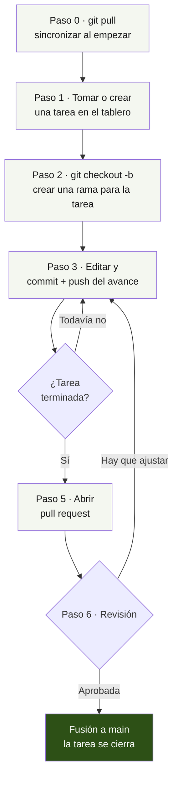
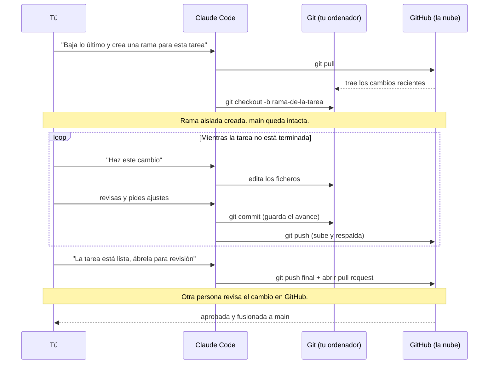

# Guía de trabajo diario · Claude/Git — T_NEUTRAL

**Guía operativa para desarrollos y bases metodológicas o taxonómicas.**
Para el trabajo diario con documentos de Office, ver la *Guía de trabajo diario con documentos de Office*. Para entender los entornos, ver el documento troncal *Entornos de trabajo* y sus anexos.

---

## 1. Antes de nada: qué trabajo entra aquí y qué trabajo no

No todo el trabajo de T_NEUTRAL pasa por Git ni por Claude Code. Esta guía aplica solo a los proyectos que viven en un repositorio: definición de criterios y modelos, código, configuración, documentación técnica en texto. Una memoria en Word, una presentación, la contabilidad o un correo no siguen este flujo; se trabajan con las herramientas ofimáticas de siempre y se guardan donde corresponda (ver el Anexo A y su guía de Office).

La señal es sencilla: si lo que produces es texto plano que evoluciona con el tiempo y otras personas pueden necesitar revisar o continuar, va en un repositorio y sigue esta guía. Si es un fichero cerrado que alguien abrirá en Word o PowerPoint, no.

Esta guía es de buenas prácticas y estructura de trabajo. Describe el modo de trabajar hacia el que avanzamos, que se construye con cada proyecto sobre la marcha. Algunas piezas (como la validación automática) se incorporan cuando la estructura del proyecto está madura; la sección 7 explica cuándo.

---

## 2. Los cuatro principios

1. **Autonomía.** El trabajo avanza sin esperar aprobación en cada paso. Se registra el avance a diario.
2. **Visibilidad.** El progreso se ve sin necesidad de preguntar: el historial de cambios y el tablero de tareas hablan por sí solos.
3. **Control.** Git registra todo. Si dos personas editan lo mismo a la vez, Git lo detecta y obliga a resolverlo de forma consciente, en lugar de que un cambio pise al otro en silencio.
4. **Validación progresiva.** Al principio de un proyecto, la revisión es manual y toma pocos minutos. Las comprobaciones automáticas se añaden más tarde, cuando la estructura es lo bastante estable como para saber qué merece la pena automatizar.

---

## 3. Antes de la primera sesión en un proyecto

La primera vez que se trabaja en un proyecto, leer en este orden lo que exista:

1. **El README del repositorio.** Explica qué es el proyecto, qué produce y cómo está organizado.
2. **El documento fundacional del proyecto**, si lo hay: el que define sus criterios, reglas o arquitectura.
3. **La guía de incorporación al proyecto**, si el proyecto es reciente: indica qué comprobaciones existen ya y cuáles están todavía por construir.
4. **Las convenciones del proyecto**, si están documentadas: formatos, terminología, idioma de los mensajes de commit.

Si falta algo de esto y es tu primera vez en el proyecto, **pregunta antes de empezar.** No se puede estructurar bien una tarea sin conocer el contexto, y empezar a ciegas genera trabajo que luego hay que rehacer.

---

## 4. El ciclo de trabajo, paso a paso

Todo cambio recorre el mismo ciclo, siempre en el mismo orden. Puede parecer mucho la primera vez; a partir de la tercera o cuarta, el trabajo con Git ocupa unos pocos minutos al día.

Antes de desgranar cada paso, la vista completa del ciclo:



Los dos bucles del diagrama son la parte importante: se repite el paso 3 hasta terminar, y si la revisión pide ajustes, se vuelve al paso 3. El trabajo no es una línea recta, sino un ciclo que se recorre las veces que haga falta hasta que el cambio está listo.

### Paso 0. Empezar el día sincronizando

Antes de tocar nada, baja a tu ordenador los cambios que otros hayan podido subir mientras no trabajabas:

```
git pull
```

Es inmediato y evita el problema más común del trabajo en equipo: editar sobre una versión antigua y encontrarte un conflicto al final. Hazlo siempre al empezar, aunque creas que nadie ha tocado nada.

### Paso 1. Tomar o crear una tarea

Las tareas se organizan como fichas en el tablero del proyecto (una **Issue**, en el vocabulario de GitHub). Una Issue es una unidad de trabajo con un título y una descripción.

Si ya existe una ficha para lo que vas a hacer, asígnatela y márcala como "en progreso". Si tu tarea no tiene ficha todavía, créala antes de empezar: un título claro y una descripción breve de qué hay que hacer y qué condiciones debe cumplir. Trabajar siempre desde una ficha es lo que da la visibilidad del principio 2: cualquiera puede ver en qué se está trabajando sin preguntar.

### Paso 2. Crear una rama para esa tarea

Una **rama** es una línea de trabajo separada. Te permite hacer cambios sin tocar la versión validada del proyecto (la rama principal, llamada `main`) hasta que tu trabajo esté listo. Una rama por tarea:

```
git checkout -b descripcion-corta-de-la-tarea
```

El nombre de la rama debe describir la tarea en pocas palabras, sin espacios. Mientras trabajas en tu rama, `main` permanece intacta: si algo sale mal, la versión buena sigue estando a salvo. Este es el mecanismo que hace posible el trabajo colaborativo controlado: cada persona en su rama, sin pisar el trabajo de las demás ni la versión validada.

### Paso 3. Trabajar y registrar el avance

Edita los ficheros que necesites. Al final de cada sesión de trabajo, guarda tu avance en un commit:

```
git add .
git commit -m "Mensaje que describe qué has hecho"
```

Un **commit** es una fotografía de tus cambios con una descripción. Si el trabajo no está terminado, dilo en el mensaje (la convención habitual es empezar por `WIP`, de *work in progress*, trabajo en curso), para que el equipo sepa que aún no está cerrado.

Después, sube tu rama a GitHub para que el avance quede respaldado y visible:

```
git push
```

Recuerda lo del Anexo B: hasta que no haces `push`, tus commits solo existen en tu ordenador. Subir a diario evita perder trabajo y permite que otros vean por dónde vas.

### Paso 4. Comunicar solo si hay algo que decidir

Si el trabajo avanza sin obstáculos, no hace falta comentar nada: los commits diarios ya cuentan la historia. Comenta en la ficha únicamente cuando haya una pregunta o una decisión pendiente que te bloquee, describiendo con precisión qué necesitas para continuar. Así la conversación queda registrada junto a la tarea, y no dispersa en mensajes sueltos.

### Paso 5. Abrir una pull request cuando la tarea está lista

Cuando el trabajo está terminado, haz el último commit indicando que la tarea queda cerrada, súbelo, y abre una **pull request** en GitHub.

Una pull request es la solicitud de incorporar tu rama a la versión validada. Muestra exactamente qué cambia, permite que otra persona lo comente y exige aprobación antes de fusionarse. En su descripción, explica brevemente qué has hecho y por qué; esa explicación es lo que la persona que revisa necesita para aprobar con criterio.

### Paso 6. Revisión y fusión

La revisión tiene dos partes, según la fase del proyecto (ver sección 7):

- **Comprobación automática**, cuando el proyecto ya la tiene montada: verifica sola que el formato es correcto, que las referencias existen y que se respetan las convenciones.
- **Revisión de una persona**: comprueba que el cambio tiene sentido. En un proyecto reciente, esta revisión es manual y toma pocos minutos.

Si todo está bien, quien revisa fusiona la rama a `main`. Si algo falla o hay que ajustar, se comenta en la propia pull request; corriges, vuelves a subir, y la pull request se actualiza sola. Al fusionarse, la ficha de la tarea se cierra.

La garantía de todo este ciclo: la rama principal contiene en todo momento una versión íntegra y revisada del proyecto. Nadie trabaja nunca sobre una base rota.

---

## 5. Cómo es un día normal

El trabajo con Git no debería ocupar más de unos minutos al día. Un día típico:

- Al empezar, `git pull` y un vistazo al tablero para ver qué tarea toca.
- Si es un día nuevo sobre una tarea ya empezada, cambias a su rama con `git checkout nombre-rama`.
- El grueso del día es trabajo real sobre los ficheros, sin pensar en Git.
- Al terminar, `git add`, `git commit` y `git push`. Un par de minutos.
- Si hay algo que decidir, un comentario en la ficha.

El diagrama siguiente muestra quién hace qué a lo largo de una tarea, y cómo se reparten el trabajo la persona, Claude Code y Git. La persona decide y revisa; Claude Code edita y ejecuta los comandos; Git y GitHub guardan y sincronizan. Cada franja horizontal es un intercambio:



Conviene fijarse en dos cosas. La primera, que **tú nunca escribes comandos de Git**: se los pides a Claude Code en lenguaje natural y él los ejecuta, explicando qué hace. La segunda, que el bucle central (editar, revisar, guardar, subir) se repite tantas veces como haga falta, exactamente igual que el paso 3 del ciclo anterior. La decisión de qué se hace y de si está bien es siempre tuya; la mecánica la lleva la herramienta.

Las reuniones, con este ritmo, dejan de ser "¿qué has hecho?", porque eso ya se ve en el tablero y el historial. Pasan a ser "¿qué decidimos sobre lo que está pendiente?", y duran mucho menos.

---

## 6. Cuando algo se tuerce: problemas frecuentes

**"Hago commit y no aparece en GitHub."** Te falta el `git push`. El commit existe en tu ordenador, pero no lo has subido. Ejecuta `git push`.

**"No sé si estoy trabajando en `main` o en una rama."** Ejecuta `git status`: la primera línea te dice en qué rama estás. La regla es que nunca trabajas directamente en `main`; si te has descubierto haciéndolo, crea una rama antes de continuar.

**"Dos personas hemos tocado el mismo fichero y Git da un conflicto."** Es normal y el sistema está diseñado para ello. Ocurre cuando dos ramas cambian las mismas líneas. Al fichero le aparecen unas marcas (`<<<<<<`, `======`, `>>>>>>`) que señalan las dos versiones en disputa. Se resuelve editando el fichero para dejar la versión correcta, borrando esas marcas y haciendo commit. Si no tienes claro cuál debe prevalecer, pregunta antes de decidir: un conflicto mal resuelto puede perder trabajo de otra persona.

**"He editado un fichero que no debía tocar."** Si todavía no has hecho push, puedes deshacer los cambios de ese fichero con `git checkout -- nombre-del-fichero`. Si ya has hecho push, avísalo en la pull request para que se revise antes de fusionar.

**"La comprobación automática falla y no entiendo el error."** Léela con calma: casi siempre señala el fichero y la línea. Si aun así no lo entiendes, no fuerces la fusión: pregunta.

---

## 7. Cómo evoluciona la validación con el proyecto

Las comprobaciones automáticas no existen desde el primer día. Se construyen a partir de los errores reales que aparecen en las primeras semanas, y esa es precisamente la forma correcta de montarlas: automatizar lo que de verdad falla, no lo que uno imagina que podría fallar.

**Fase inicial — revisión manual.** Durante las primeras semanas de un proyecto, cada pull request la revisa una persona en pocos minutos: que el formato sea correcto, que las referencias existan, que se respete la nomenclatura. El trabajo avanza sin fricción y, de paso, se observa qué tipo de errores se repiten.

**Fase de consolidación — creación de comprobaciones.** Con el patrón de errores identificado, se dedican un par de horas a escribir comprobaciones automáticas para los fallos más frecuentes. Estas comprobaciones viven en el propio repositorio y se ejecutan solas en cada pull request.

**Fase estable — validación automática.** A partir de ahí, cada cambio recibe una respuesta automática en minutos sobre si cumple las reglas, y la revisión humana se concentra en lo que una máquina no puede juzgar: si el cambio tiene sentido.

Este es el trabajo que se hace con el primer proyecto piloto, en equipo: montar la estructura, observar los errores, y construir las comprobaciones a partir de ellos. No es un proceso que se herede ya hecho, sino uno que se aprende construyéndolo.

---

## 8. Cuándo parar y preguntar

La autonomía tiene un límite sano. Conviene detenerse y consultar cuando:

- No tienes claro si un cambio afecta solo al contenido o toca la estructura o las reglas de fondo del proyecto.
- Un conflicto entre ramas no se deja resolver con claridad.
- Una comprobación automática falla y el error no se entiende.
- Alguien señala que no deberías tocar cierta cosa, pero no está claro por qué.

La forma de escalar es abrir una ficha describiendo el bloqueo, o preguntar directamente, siempre en el contexto del proyecto. Preguntar a tiempo no es una interrupción: es lo que evita rehacer trabajo.

---

## 9. Antes de cerrar la sesión

Aunque sientas que "casi está", haz esto al terminar:

1. **Sube lo que tengas.** No dejes trabajo solo en tu ordenador sin `push`.
2. **Deja constancia de lo pendiente.** Si hay una decisión en el aire o una pregunta sin resolver, escríbela en la pull request o en la ficha.
3. **Actualiza tu estado** en una línea, donde el equipo lo vea: qué has avanzado y qué queda esperando.

---

## 10. Referencia rápida de comandos

| Comando | Qué hace |
|---|---|
| `git pull` | Baja a tu ordenador los cambios de GitHub. Hazlo al empezar el día. |
| `git checkout -b nombre-rama` | Crea una rama nueva y cambia a ella. |
| `git checkout nombre-rama` | Cambia a una rama que ya existe. |
| `git status` | Muestra en qué rama estás y qué ficheros has cambiado. |
| `git add .` | Prepara todos los cambios para el próximo commit. |
| `git commit -m "mensaje"` | Registra los cambios con una descripción. |
| `git push` | Sube tus commits a GitHub. Hazlo al terminar. |
| `git log` | Muestra el historial de commits. |
| `git checkout -- fichero` | Deshace los cambios locales de un fichero (antes de hacer push). |

---

## 11. Glosario

| Término | Significado |
|---|---|
| Issue / ficha | Una tarea, con título y descripción, en el tablero del proyecto. |
| Rama | Línea de trabajo paralela que no afecta a la versión validada hasta su fusión. |
| Commit | Fotografía de tus cambios con una descripción de qué y por qué. |
| Pull request | Solicitud de incorporar una rama a la versión validada, tras revisión. |
| Fusión (*merge*) | La incorporación de una rama a `main` una vez aprobada. |
| Conflicto | Cuando dos ramas cambian las mismas líneas y Git pide resolver cuál prevalece. |
| `main` | La rama principal, siempre validada y lista para usar. |
| WIP | *Work in progress*: marca en un commit que el trabajo aún no está terminado. |
| Comprobación automática | Proceso que valida solo un cambio en cada pull request. Se añade cuando el proyecto madura. |

---

## 12. Punto de partida

Tras leer esta guía, ya sabes cómo empieza y termina un día de trabajo sobre un repositorio, cómo se toma una tarea, cómo se aísla en una rama, cómo se registra el avance, cómo se solicita la incorporación a la versión validada y cuándo conviene parar y preguntar.

La mejor forma de asentarlo es hacer una primera tarea pequeña siguiendo estos pasos al pie de la letra. Ese primer recorrido completo, aunque sea para un cambio mínimo, es la inversión que hace que todas las tareas siguientes salgan solas.
