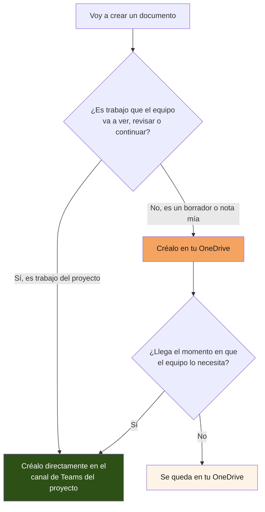
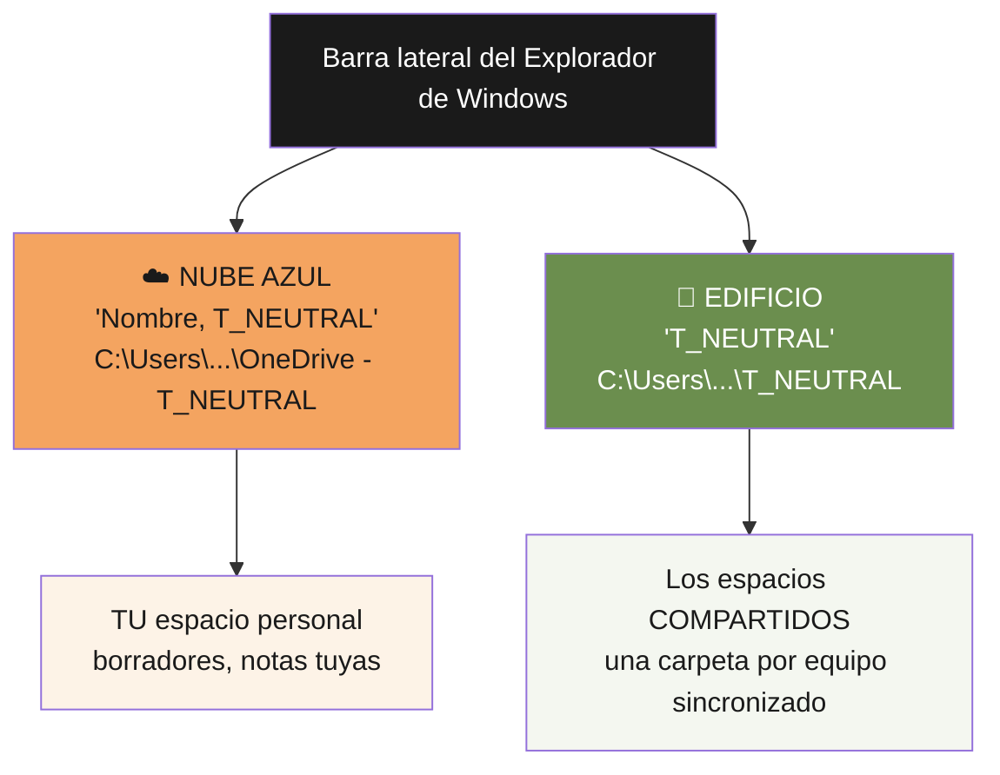
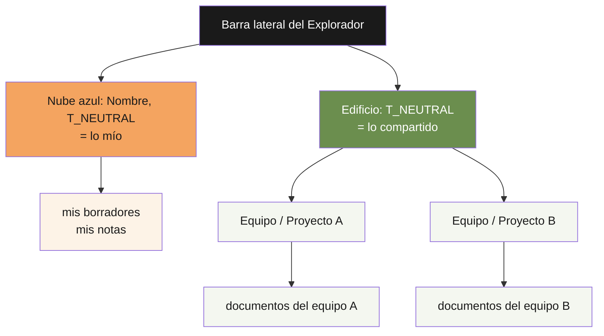

# Guía de trabajo diario · Documentos de Office — T_NEUTRAL
 
**Guía operativa para el trabajo del día a día en Microsoft 365.**
Para el trabajo de desarrollo o de bases metodológicas, ver la *Guía de trabajo diario Claude/Git*. Para entender los entornos, ver el documento troncal *Entornos de trabajo* y el Anexo A (Microsoft 365).
 
---
 
## 1. Para qué sirve esta guía
 
El Anexo A explica qué son SharePoint, OneDrive y Teams y dónde debe vivir cada cosa. Esta guía da el paso siguiente: **cómo se trabaja con eso cada día**, desde que abres un documento hasta que lo das por cerrado, sin generar copias sueltas ni versiones perdidas.
 
Aplica a todo el trabajo ofimático: documentos de Word, hojas de Excel, presentaciones de PowerPoint, y cualquier fichero que se abra en Office. No aplica al trabajo que vive en repositorios de Git, que tiene su propia guía.
 
La regla de fondo, de la que se derivan todas las demás: **una sola copia de cada cosa, en el sitio compartido, compartida por enlace.** Si solo se recuerda esto, casi todo lo demás sale bien.
 
---
 
## 2. Antes de empezar: ¿dónde nace el documento?
 
La primera decisión, y la que más problemas evita, es dónde creas el documento. Depende de una sola pregunta: ¿es trabajo del equipo o una nota tuya?
 

 
En la práctica, la mayoría del trabajo de proyecto puede nacer directamente en el canal de Teams correspondiente. Empezar ahí ahorra el paso de mover el documento más tarde, y evita el olvido más común: dejarlo en OneDrive y que nadie más lo encuentre.
 
Reserva tu OneDrive para lo que de verdad es tuyo y provisional: un borrador que aún no quieres enseñar, notas personales, un cálculo rápido. En cuanto eso se convierte en trabajo compartido, muévelo a la carpeta del proyecto (desde Teams, desde SharePoint, o arrastrándolo en el Explorador si trabajas en local, como explica la sección 4).
 
---
 
## 3. El día a día, paso a paso
 
### Paso 1. Abrir el documento desde su sitio
 
Abre el documento desde donde vive: el canal de Teams del proyecto, o la carpeta de SharePoint correspondiente. No lo abras desde una copia descargada ni desde un adjunto de correo: esas copias están desconectadas del original y cualquier cambio que hagas ahí se pierde para el equipo.
 
Si trabajas mucho con un documento, fíjalo como pestaña en el canal o márcalo como favorito, para no tener que buscarlo cada vez.
 
### Paso 2. Elegir cómo editar: en línea o en local
 
Hay dos formas de trabajar un documento, y ambas son correctas si se hacen bien. La diferencia está en dónde tienes abierto Office, no en dónde vive el documento: el documento vive siempre en su sitio compartido, se edite como se edite.
 
**En línea (en el navegador).** Abres el documento desde Teams o SharePoint y lo editas en la versión web de Office. Es lo más simple y lo que menos puede salir mal: no hay nada que descargar, los cambios se guardan solos y no existe riesgo de duplicado. Es la mejor opción para cambios rápidos, para revisar, y para quien no quiera complicarse.
 
**En local (en la aplicación de escritorio).** Editas el documento con el Word, Excel o PowerPoint instalados en tu ordenador. Es más completo y más cómodo para trabajo intenso: todas las funciones de Office, más velocidad, y posibilidad de trabajar sin conexión. Pero solo es seguro si tienes la sincronización de OneDrive bien montada; si no, es la principal fuente de duplicados. La sección 4 explica cómo montarla desde cero, una sola vez.
 
En ambos casos, la clave es la misma: **el documento no se descarga a una carpeta suelta ni se sube a mano.** En línea, porque nunca sale del sitio. En local bien montado, porque la sincronización mantiene tu copia y la del equipo como el mismo documento, sin que tengas que mover nada.
 
Editar en línea o en local sustituye por completo al viejo hábito de descargar el fichero a la carpeta de Descargas, editarlo y volver a subirlo. Ese ciclo manual es el que genera las copias divergentes: mientras tú editas tu descarga, otro edita la suya, y al final hay dos versiones irreconciliables. Los dos modos correctos evitan ese problema, cada uno a su manera.
 
### Paso 3. No renombrar por versiones
 
Cuando el documento avanza, **no crees `documento_v2` ni `documento_final`.** El historial de versiones de SharePoint ya guarda cada estado anterior, con quién lo cambió y cuándo, accesible desde el menú del documento. El nombre del fichero describe qué es, no en qué punto está.
 
Si necesitas volver a una versión anterior, se recupera desde el historial. Si necesitas conservar un hito concreto (por ejemplo, "la versión que se envió al consorcio"), la forma correcta no es duplicar el fichero, sino anotarlo (el historial permite ver la fecha de ese envío) o, si de verdad hace falta un fichero aparte inmutable, exportarlo a PDF con nombre descriptivo y guardarlo en una carpeta de entregables.
 
### Paso 4. Compartir por enlace, nunca por adjunto
 
Cuando alguien necesite el documento, comparte el **enlace**, no el fichero. Desde Teams o desde el propio documento, "Compartir" genera un enlace a la versión viva. Quien lo abre ve siempre el estado actual, y si el documento cambia, no hay que reenviar nada.
 
Enviar el documento como adjunto de correo crea una copia que nace desactualizada en el momento del envío. A partir de ahí, cada destinatario tiene su copia, y las versiones se multiplican. El adjunto es el origen del desorden que esta guía existe para evitar.
 
Al compartir por enlace, comprueba a quién se lo das: el enlace puede ser para el equipo, para personas concretas, o para cualquiera con el enlace. Para material interno, comparte con el equipo o las personas concretas, no con "cualquiera con el enlace".
 
### Paso 5. Dejar el documento en su sitio al terminar
 
Al acabar la sesión no hay que "guardar y subir": el documento ya está guardado en su sitio y ya está subido, porque nunca salió de ahí. Esa es la ventaja de trabajar en línea desde el principio.
 
Lo único que conviene al cerrar: si el documento ha llegado a un hito o queda algo pendiente, dejarlo dicho en el chat del canal, para que el equipo lo sepa sin tener que abrir el archivo.
 
---
 
## 4. Trabajar en local con OneDrive: montaje desde cero
 
Trabajar en local significa editar los documentos con las aplicaciones de Office instaladas en tu ordenador, viéndolos como carpetas normales en el Explorador de archivos de Windows. Es más cómodo y potente que el navegador, pero requiere una instalación inicial que se hace **una sola vez**. Bien montada, no genera duplicados; mal entendida, es la mayor fuente de ellos. Esta sección es el montaje paso a paso.
 
### 4.1. Los dos iconos del Explorador: qué es cada uno
 
Cuando OneDrive está funcionando, en la columna izquierda del Explorador de Windows (la barra lateral donde están "Este equipo", "Descargas", etc.) aparecen **dos entradas distintas** relacionadas con T_NEUTRAL. Tienen iconos diferentes y significan cosas diferentes. Confundirlas es el error de origen, así que conviene reconocerlas de un vistazo.
 
**Icono de NUBE AZUL, llamado algo como "Nombre, T_NEUTRAL".**
Ruta: `C:\Users\TuUsuario\OneDrive - T_NEUTRAL\`
Esto es **tu espacio personal**. La nube azul es el icono de OneDrive de empresa. Todo lo que pongas aquí es tuyo, privado, y ligado a tu cuenta: si dejaras la empresa, se iría contigo. Aquí van tus borradores y tus notas, **no** los documentos del equipo.
 
**Icono de EDIFICIO (dos torres), llamado "T_NEUTRAL" a secas.**
Ruta: `C:\Users\TuUsuario\T_NEUTRAL\`
Esto es la raíz donde se agrupan **los espacios compartidos de SharePoint** que hayas sincronizado. El icono de edificio es precisamente el que Windows usa para las bibliotecas de SharePoint de una organización. Dentro de esta raíz aparece una carpeta por cada equipo o proyecto que sincronices, y ahí es donde viven los documentos del equipo.
 

 
**La regla, reducida a un gesto:** antes de guardar algo, mira en qué de las dos raíces estás. Nube azul = mío. Edificio = del equipo. Un documento del equipo va siempre bajo el edificio, nunca bajo la nube azul.
 
### 4.2. Por qué el edificio puede aparecer vacío (y qué significa)
 
Es muy habitual, al empezar, encontrarse con que **la carpeta del edificio (`C:\Users\TuUsuario\T_NEUTRAL\`) existe pero está vacía**, mientras que en los canales de Teams sí ves archivos. Esto desconcierta, pero tiene una explicación simple y no es un error:
 
**Sincronizar tu OneDrive personal no sincroniza automáticamente las bibliotecas de los equipos.** Son operaciones distintas. Al instalar OneDrive e iniciar sesión, se sincroniza solo tu espacio personal (la nube azul). Las carpetas de los equipos hay que añadirlas **una por una**, con el botón "Sincronizar" de cada canal, y hasta que no lo haces, el edificio está vacío aunque tengas acceso a esos archivos en Teams y en la web.
 
Dicho de otro modo: que veas los archivos en la pestaña Archivos de un canal de Teams **no** significa que estén en tu Explorador. Están en SharePoint (en la nube), y para traerlos a tu ordenador hace falta el paso de la sección 4.4.
 
Si además tienes alguna carpeta suelta dentro de la nube azul que no recuerdas haber creado o que está vacía, puedes borrarla sin miedo: son restos de pruebas anteriores. Lo importante es no usar la nube azul para documentos del equipo.
 
### 4.3. Paso a paso: instalación inicial de OneDrive
 
Si ya ves la nube azul en tu Explorador, OneDrive ya está instalado y con sesión iniciada; salta a la sección 4.4. Si no:
 
**Paso 1. Comprobar si OneDrive ya está.** Busca el icono de nube en la esquina inferior derecha de la pantalla, junto al reloj (puede estar oculto bajo la flecha "Mostrar iconos ocultos"). Si el icono es una nube azul, ya está y tiene sesión.
 
**Paso 2. Instalarlo si falta.** Descárgalo desde `microsoft.com/onedrive` o desde la Microsoft Store, e instálalo con las opciones por defecto.
 
**Paso 3. Iniciar sesión con la cuenta de T_NEUTRAL.** Al abrirlo por primera vez pide un correo. Usa **tu cuenta profesional de T_NEUTRAL**, no una cuenta personal de Microsoft. Este paso es el que conecta tu ordenador con el espacio de la empresa y hace aparecer la nube azul.
 
**Paso 4. Aceptar la ubicación por defecto.** Propondrá crear la carpeta en `C:\Users\TuUsuario\OneDrive - T_NEUTRAL`. Acéptala.
 
**Paso 5. Terminar el asistente.** Al acabar, la nube azul ya aparece en el Explorador. En este punto tienes sincronizado **solo tu espacio personal**; el edificio (los equipos) todavía no, y ese es el paso siguiente.
 
### 4.4. Paso a paso: traer las carpetas de los equipos al Explorador
 
Este es el paso que casi todo el mundo se salta, y el que hace aparecer las carpetas de equipo bajo el edificio. Hay que hacerlo **una vez por cada equipo** cuyos documentos quieras trabajar en local.
 
**Paso 1. Abre el canal en Teams.** Ve al equipo y canal cuyos archivos quieras sincronizar, y entra en su pestaña **Archivos**.
 
**Paso 2. Pulsa "Sincronizar".** En la barra superior de la pestaña Archivos, pulsa el botón **"Sincronizar"** (a veces aparece como "Añadir acceso directo a OneDrive"; explico la diferencia más abajo).
 
**Paso 3. Deja que Windows haga su parte.** Se abrirá brevemente la aplicación de OneDrive y empezará a preparar la carpeta. No tienes que hacer nada más.
 
**Paso 4. Comprueba el resultado en el Explorador.** Abre el Explorador y mira bajo el icono de **edificio "T_NEUTRAL"**: ahora aparece una carpeta nueva con el nombre de ese equipo o de su biblioteca de documentos. Ya no está vacío. Dentro está lo mismo que veías en la pestaña Archivos del canal, pero como carpeta local.
 
**Paso 5. Repite para cada equipo que uses.** No sincronices todos "por si acaso": solo aquellos en cuyos documentos vayas a trabajar. Cada uno añade una carpeta bajo el edificio.
 
**"Sincronizar" y "Añadir acceso directo a OneDrive": la diferencia.** Las dos traen la carpeta del equipo a tu ordenador; cambia dónde aparece. "Sincronizar" la coloca bajo el icono de **edificio** (`C:\Users\...\T_NEUTRAL\`). "Añadir acceso directo a OneDrive" la coloca **dentro de tu nube azul**, como un acceso directo. Para mantener separado lo tuyo (nube azul) de lo del equipo (edificio), **es preferible "Sincronizar"**. Si tu equipo ya usa una de las dos de forma consistente, seguid con esa para que todos veáis lo mismo.
 
### 4.5. Cómo queda tu Explorador tras el montaje completo
 
Con el personal instalado y los equipos sincronizados, la barra lateral del Explorador queda así:
 

 
La pregunta que resuelve cualquier duda al guardar: **¿estoy bajo la nube azul (mío) o bajo el edificio (del equipo)?** Un documento del equipo va siempre bajo el edificio, en la carpeta de su proyecto. Nunca bajo la nube azul.
 
### 4.6. Cómo funciona la sincronización mientras trabajas
 
Una vez montado, el funcionamiento es automático y no hay que subir ni bajar nada a mano:
 
- Abres un documento desde la carpeta del proyecto en tu Explorador, con doble clic. Se abre en el Word o Excel de escritorio.
- Editas y guardas con `Ctrl+S`, como siempre. OneDrive sube los cambios a la nube por debajo, sin que hagas nada.
- Si otra persona edita el mismo documento, sus cambios bajan a tu copia local solos.
- Todo queda en el historial de versiones de SharePoint, igual que si hubieras trabajado en línea.
**Los iconos de estado**, junto a cada fichero en el Explorador, te dicen cómo va la sincronización:
 
- **Nube azul:** el archivo está en la nube, no ocupa espacio en tu disco. Al abrirlo se descarga solo.
- **Círculo verde con check:** el archivo está sincronizado y también guardado en tu disco.
- **Flechas circulares azules:** sincronizando en este momento. Espera a que termine antes de apagar.
- **Círculo rojo con aspa:** hay un problema de sincronización. Haz clic en el icono de OneDrive para ver qué pasa.
### 4.7. Las reglas de oro del trabajo en local
 
Todo lo anterior se sostiene sobre cuatro reglas. Romperlas es lo que genera duplicados:
 
1. **Guarda siempre dentro de las carpetas sincronizadas de OneDrive.** Nunca en el Escritorio, en Descargas, ni en `Documentos` fuera de OneDrive. Un fichero fuera de esas carpetas no se sincroniza con nadie: es una isla.
2. **Distingue la nube azul (personal) del edificio (compartido).** Los documentos del equipo van bajo el **edificio**, en la carpeta de su proyecto. Tu OneDrive personal (la **nube azul**) es solo para lo tuyo. El error más común es guardar documentos de equipo en la nube azul: parece que funciona, pero quedan atados a tu cuenta y el equipo no los ve donde debería. Ante la duda, mira el icono de la raíz en la que estás guardando.
3. **No descargues copias sueltas.** Si te llega un documento por correo o lo abres desde el navegador, no lo guardes "también" en tu carpeta local con `Guardar como`. Trabájalo desde donde vive. `Guardar como` a una carpeta local es la forma más rápida de crear un duplicado.
4. **Espera a que sincronice antes de apagar.** Si el icono muestra que está sincronizando, dale unos segundos. Apagar el ordenador a media sincronización puede dejar tu copia y la de la nube desalineadas.
### 4.8. Cuándo conviene cada modo
 
No hay que elegir uno para siempre; conviven según la tarea:
 
- **En línea (navegador):** cambios rápidos, revisar un documento, trabajar desde un ordenador que no es el tuyo, o cuando no quieres complicarte. Cero riesgo de duplicado.
- **En local (escritorio):** trabajo intenso y prolongado, documentos complejos, necesidad de todas las funciones de Office, o trabajo sin conexión. Más potente, con la sincronización bien montada.
El documento es el mismo en ambos casos. Puedes empezarlo en línea y seguirlo en local, o al revés, sin que pase nada: la sincronización se encarga.
 
---
 
## 5. Reuniones y compartición en Teams, sin dejar rastros sueltos
 
El trabajo diario no es solo documentos. Dos gestos rutinarios, convocar una reunión y pasar un archivo por Teams, generan tantos descuadres como las copias sueltas de Office si se hacen sin criterio. El fundamento de por qué (cada equipo su sitio, Teams como ventana a SharePoint) está en el Anexo A; aquí va el cómo del día a día.
 
### 5.1. Convocar una reunión para que sus notas queden en el equipo
 
La grabación, la transcripción y las notas de una reunión se guardan donde la reunión nace. Convócala desde el canal del proyecto y quedan en el sitio del equipo, a la vista de todos. Convócala desde Outlook o desde el calendario general y quedan en tu OneDrive personal, fuera del alcance del equipo. La diferencia entre que el equipo encuentre las notas o que dependan de tu cuenta se decide en el momento de convocar, no después.
 
**Cómo convocar desde el canal:**
 
1. Ve al canal del proyecto en Teams (el canal de la línea de trabajo correspondiente).
2. Usa la opción de reunión del propio canal: el botón de reunirse del canal, o "Nueva reunión" eligiendo ese canal como ubicación. La señal de que lo has hecho bien es que la reunión aparece anunciada en el hilo del canal, visible para sus miembros.
3. Convoca a los asistentes como siempre. Los de dentro del equipo ya tienen acceso al canal; a un invitado externo se le añade a la convocatoria.
**Para que quede transcripción:** actívala al empezar la reunión (opción "Iniciar transcripción" o "Grabar y transcribir"). No siempre está activada por defecto. Sin ese paso, habrá grabación pero no texto transcrito.
 
**Dónde aparece después:** en la pestaña Archivos del canal, o en la carpeta del canal en el Explorador si trabajas en local, junto al resto de documentos del proyecto. No hay que mover nada.
 
El reflejo que conviene coger: antes de crear la reunión, piensa dónde quieres que vivan sus notas, y convócala desde ese canal. Una reunión interna, desde un canal interno; una reunión de una línea del cliente, desde el canal de esa línea.
 
### 5.2. Pasar un archivo por Teams: enlace, no arrastre
 
Cuando alguien necesita un documento que ya vive en un sitio de equipo, la forma correcta de dárselo por Teams es el enlace, no arrastrar el fichero al chat. Arrastrar el fichero genera una copia, y dónde acaba esa copia depende de si lo sueltas en un canal o en un chat privado.
 
**Si sueltas el archivo en un chat privado** (una conversación entre personas, no un canal), Teams sube una copia a tu OneDrive personal y comparte esa copia. Los demás abren tu copia, no el original. Si el documento ya existía en un sitio de equipo, acabas de crear una segunda versión en tu cajón personal, con el riesgo de que las dos diverjan.
 
**Si sueltas el archivo en el canal de un equipo,** Teams lo guarda en el sitio de ese equipo. Si el documento no existía en ningún sitio compartido, esto está bien: queda archivado donde debe. Pero si ya vivía en otro sitio, otra vez tienes dos copias.
 
**La regla, en un gesto:** si el documento ya vive en un sitio de equipo, no lo arrastres; copia su enlace ("Compartir" o "Copiar vínculo" desde el documento) y pega el enlace en el chat o el canal. Todos abren el mismo original. Arrastrar el fichero solo tiene sentido cuando el documento aún no vivía en ningún sitio compartido y quieres que ese canal sea su primer hogar; y ni siquiera entonces en un chat privado, porque ahí acaba en tu OneDrive.
 
Es la misma idea del adjunto de correo (paso 4 de la sección 3), trasladada a Teams: arrastrar el fichero a un chat es la versión Teams del adjunto. Enlace siempre que el documento ya tenga casa.
 
### 5.3. No trabajar en la raíz de SharePoint
 
Al entrar en la página principal de SharePoint aparece el sitio raíz de la organización. No es el sitio para dejar trabajo: en la configuración habitual lo ve toda la empresa, y no tiene un equipo responsable. Cualquier documento va al sitio de su equipo (interno, del cliente, del proveedor), nunca a una carpeta suelta en la raíz. Si dudas dónde va algo, la duda es la señal de que pertenece a un equipo concreto, no a la raíz.
 
---
 
## 6. Situaciones frecuentes
 
**"Me han pasado un documento por correo para revisarlo."** Si es de alguien del equipo, pídele el enlace en lugar del adjunto, o súbelo tú al canal del proyecto y trabaja ahí. Si es de fuera de la empresa (un socio, un cliente), guárdalo en la carpeta del proyecto en SharePoint y trabaja sobre esa copia única, no sobre el adjunto en tu bandeja de entrada.
 
**"Quiero empezar un documento nuevo para el proyecto."** Créalo directamente en el canal de Teams del proyecto (pestaña Archivos, o desde el propio Office guardando en la carpeta sincronizada del equipo). Así nace ya en el sitio correcto.
 
**"Es un borrador que todavía no quiero enseñar."** Perfecto para OneDrive personal. Cuando esté listo para que el equipo lo vea, muévelo a la carpeta del proyecto. Ese es el momento de moverlo, ni antes ni después.
 
**"Necesito la versión que enviamos la semana pasada."** Está en el historial de versiones del documento, con su fecha. No hace falta que exista un fichero `_enviado_semana_pasada`; el historial lo tiene.
 
**"Dos personas necesitamos trabajar en el mismo documento a la vez."** Hacedlo. La edición simultánea está pensada exactamente para eso, tanto en línea como en local: ambos veis los cambios del otro. Lo que no debéis hacer es cada uno descargar su copia suelta y editarla por separado.
 
**"El documento está en un canal, pero también lo veo en SharePoint. ¿Cuál es el bueno?"** Son el mismo. El canal de Teams te muestra la carpeta de SharePoint del equipo; el documento es uno solo, visto desde dos puertas. Edita cualquiera de las dos vistas: es el mismo fichero.
 
**"Trabajo en local y no sé si mis cambios se han subido."** Mira el icono de estado junto al fichero en el Explorador: el círculo verde con check significa sincronizado. Si ves flechas circulares, aún está subiendo; dale unos segundos. Nunca apagues el ordenador con la sincronización a medias.
 
**"Guardé un documento del equipo en mi carpeta personal por error."** Muévelo a la carpeta del proyecto arrastrándolo dentro del propio Explorador. Como las dos carpetas están sincronizadas, al moverlo pasa a estar en el espacio compartido y el equipo lo verá. Comprueba que no quedó una copia en la personal.
 
**"Voy a trabajar en un sitio sin conexión."** Con el trabajo en local esto funciona: abre y edita los documentos de la carpeta sincronizada aunque no tengas internet. Al recuperar conexión, OneDrive sube tus cambios solo. La única precaución: asegúrate antes de salir de que los ficheros que vas a necesitar están descargados (icono de círculo verde), no solo en la nube (icono de nube azul).
 
**"Voy a convocar una reunión de proyecto y quiero que la transcripción quede accesible al equipo."** Convócala desde el canal del proyecto, no desde Outlook ni desde el calendario general. Así grabación, transcripción y notas quedan en el sitio del equipo. Acuérdate de activar la transcripción al empezar; no siempre está puesta por defecto.
 
**"Quiero pasarle a una compañera un documento que ya está en el sitio del equipo."** Comparte el enlace, no arrastres el fichero al chat. Arrastrarlo a un chat privado crea una copia en tu OneDrive, y entonces hay dos. Con el enlace, las dos abrís el mismo original.
 
**"Arrastré un archivo a un chat privado de Teams y no sé qué pasó."** Teams subió una copia a tu OneDrive y compartió esa copia. Si el documento ya vivía en el sitio de un equipo, quédate con ese y borra la copia del chat. Para la próxima, enlace en lugar de arrastre.
 
---
 
## 7. Los hábitos que sostienen el sistema
 
Si todo el equipo mantiene estos hábitos, el desorden documental no aparece:
 
1. **El trabajo del equipo nace y vive en la carpeta del proyecto** (canal de Teams o su carpeta sincronizada), no en OneDrive personal ni en carpetas sueltas.
2. **Se edita en línea o en local bien sincronizado, nunca en copias descargadas sueltas.**
3. **El nombre del fichero no lleva versión ni fecha**; el historial hace ese trabajo.
4. **Se comparte por enlace, nunca por adjunto ni arrastrando el fichero a un chat.**
5. **Las reuniones de proyecto se convocan desde su canal**, para que grabación y transcripción queden en el equipo.
6. **Una sola copia de cada documento.** Ante la duda de si duplicar, no se duplica.
---
 
## 8. Punto de partida
 
Tras leer esta guía, ya sabes cómo transcurre la vida diaria de un documento de Office: dónde nace según sea tuyo o del equipo, cómo se trabaja en línea sin generar copias, por qué no se renombra por versiones, por qué se comparte por enlace y no por adjunto, y cómo convocar reuniones y pasar archivos por Teams sin dejar copias sueltas.
 
El resto del ecosistema (por qué las herramientas funcionan así, qué es cada una) está en el documento troncal *Entornos de trabajo* y en el Anexo A. Esta guía es solo el día a día; el fundamento está allí.
