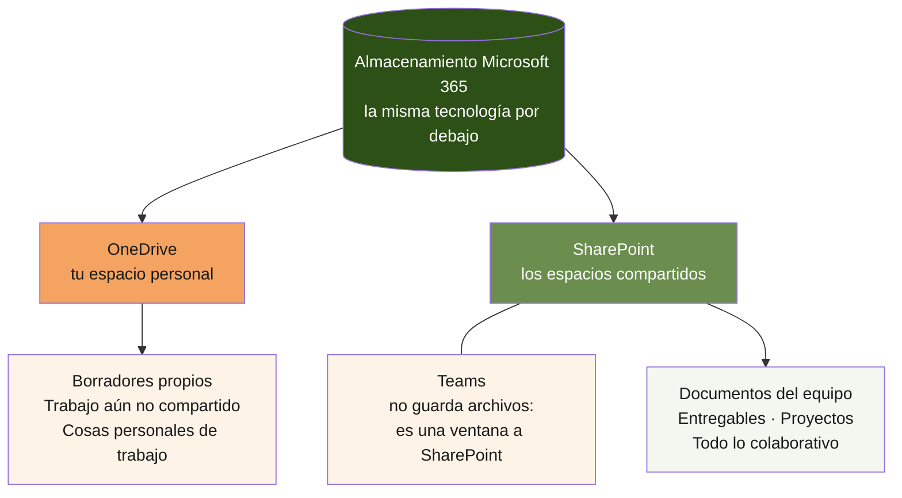
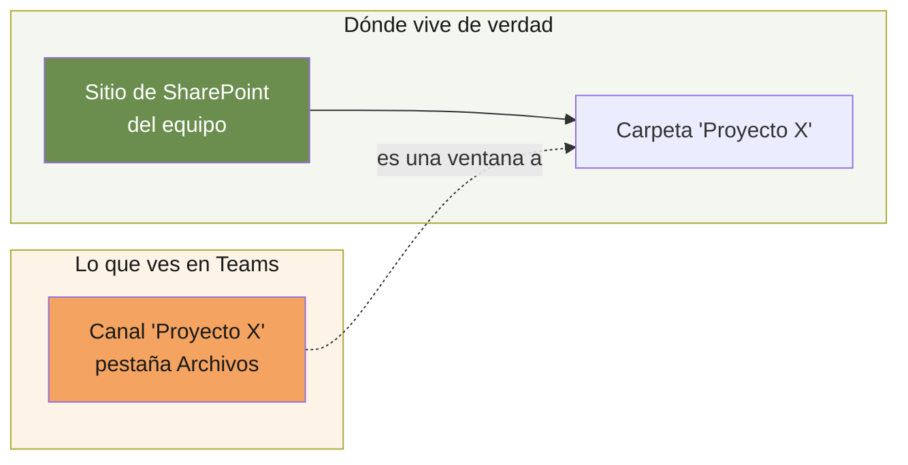
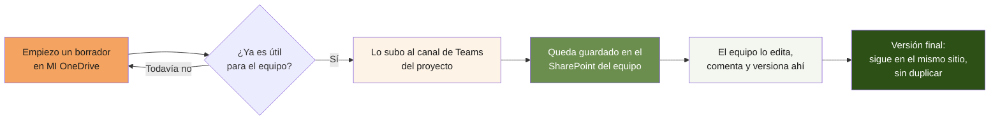

# Anexo A · Microsoft 365: dónde vive cada cosa
 
**Anexo del documento troncal *Entornos de trabajo*.**
Aplicable a todo el equipo. Es la base de la higiene documental de la empresa. Para la visión de conjunto de todos los entornos, ver el documento troncal. Para el día a día, ver la *Guía de trabajo diario con documentos de Office*.
 
---
 
## 1. Por qué este documento existe
 
SharePoint, OneDrive y Teams generan más confusión que cualquier otra herramienta de la empresa, y no por ser complicadas, sino por una razón que casi nadie conoce: **las tres son, por debajo, el mismo sistema de almacenamiento visto desde tres puertas distintas.** Cuando no se entiende esto, la misma empresa acaba con documentos duplicados en tres sitios, versiones que se pisan, enlaces que dejan de funcionar y la pregunta recurrente de "¿dónde estaba ese archivo?".
 
Este documento explica qué es cada herramienta, qué papel cumple, cómo se relacionan entre sí y qué hábitos mantienen el trabajo ordenado. Leerlo entero, una vez, ahorra decenas de "¿me reenvías el archivo?" a lo largo del año.
 
---
 
## 2. La idea que lo desatasca todo
 
Detrás de SharePoint, OneDrive y Teams hay una única tecnología de almacenamiento. Lo que cambia es la puerta por la que entras y para qué está pensada cada puerta.
 

 
De este esquema salen las tres reglas que resuelven la mayoría de las dudas:
 
1. **OneDrive es tu cajón personal.** Lo que guardas ahí es tuyo, privado por defecto, y desaparece de la vista del equipo si tú te vas.
2. **SharePoint es el archivo común.** Lo que vive ahí es de la empresa, sobrevive a las personas y es donde debe estar cualquier cosa que otro pueda necesitar.
3. **Teams no guarda nada.** Cuando ves archivos en un canal de Teams, estás mirando una carpeta de SharePoint a través de una ventana. El archivo vive en SharePoint; Teams solo te lo enseña.
Si interiorizas solo esto, ya evitas el 80 % de los problemas.
 
---
 
## 3. OneDrive: tu espacio personal
 
### Qué es
 
OneDrive es tu cajón privado en la nube. Cada persona del equipo tiene el suyo, ligado a su cuenta. El espacio disponible por cuenta depende del plan de Microsoft 365 contratado; la cifra concreta se consulta en la administración de la cuenta.
 
### Para qué sirve
 
- Borradores y trabajo en curso que todavía no quieres que nadie vea.
- Notas personales de trabajo, tu propia organización.
- Archivos que son tuyos por rol pero no del equipo (tu firma, tus plantillas personales).
### Para qué NO sirve
 
- **Cualquier cosa que otra persona pueda necesitar.** Si un documento importa a alguien más, no puede vivir solo en tu OneDrive.
- **Entregables, documentos de proyecto, versiones finales.** Eso es de la empresa y va a SharePoint.
### El riesgo que hay que entender
 
Lo que está en tu OneDrive **depende de ti**. Si compartes un enlace a un archivo de tu OneDrive y luego lo mueves, lo renombras o dejas la empresa, ese enlace se rompe y el equipo pierde acceso. Por eso la regla es tajante: en cuanto algo deja de ser un borrador privado y pasa a ser trabajo compartido, se mueve a SharePoint. OneDrive es la sala de espera, no el destino.
 
---
 
## 4. SharePoint: el archivo de la empresa
 
### Qué es
 
SharePoint es el sistema donde viven los documentos compartidos, organizados en **sitios**. Un sitio es un espacio de almacenamiento con sus carpetas, sus permisos y sus miembros, pensado para un equipo o un propósito.
 
La diferencia esencial con OneDrive: **lo que está en SharePoint pertenece a la empresa, no a una persona.** Sobrevive a quien lo creó, mantiene su historial de versiones y sigue accesible aunque alguien se vaya.
 
### Para qué sirve
 
- Todos los documentos de proyecto, presentes y pasados.
- Entregables, memorias, plantillas oficiales, material que circula.
- Cualquier cosa que más de una persona necesite abrir, ahora o en el futuro.
### El historial de versiones, que casi nadie usa y debería
 
SharePoint guarda automáticamente el historial de cada documento. Puedes ver quién cambió qué y volver a una versión anterior. Esto tiene una consecuencia liberadora que corrige el peor hábito documental: **no hace falta guardar `propuesta_v3_final_FINAL_revisada.docx`.** El archivo se llama `propuesta.docx` y punto; sus versiones anteriores están guardadas por debajo, accesibles con un par de clics desde el menú del archivo (Historial de versiones). Poner fechas y "v_final" en el nombre es hacer a mano, y mal, lo que la herramienta ya hace sola y bien.
 
---
 
## 5. Teams: la ventana, no el almacén
 
### Qué es
 
Teams es donde el equipo conversa, se reúne y trabaja. Se organiza en **equipos** (por ejemplo, un equipo por área o por proyecto), y cada equipo tiene **canales** (subdivisiones temáticas dentro de él).
 
### La clave que resuelve la confusión
 
**Cada equipo de Teams crea automáticamente un sitio de SharePoint por detrás.** Cuando alguien sube un archivo a la pestaña "Archivos" de un canal, ese archivo no se guarda "en Teams": se guarda en el sitio de SharePoint de ese equipo, en una carpeta con el nombre del canal. Teams solo te lo muestra.
 

 
Esto tiene tres consecuencias prácticas que conviene tener claras:
 
- **Subir un archivo a un canal de Teams ES ponerlo en SharePoint.** No es un sitio distinto ni una copia. Es el mismo archivo, visto desde otra puerta. Por eso subir a Teams cuenta como archivar bien, siempre que sea el canal correcto.
- **No dupliques.** Si un documento ya está en el canal de Teams del proyecto, no hace falta "guardarlo también en SharePoint": ya está en SharePoint. Buscar el mismo archivo en las dos puertas y editar copias distintas es la causa número uno de versiones divergentes.
- **La conversación y el archivo van juntos.** La ventaja de trabajar desde Teams es que el chat del canal, las reuniones y los archivos del proyecto están en el mismo sitio. Esa es la razón de usar Teams como centro.
### Para qué sirve cada parte de Teams
 
- **Chat de canal:** conversación del equipo sobre un tema, visible para todos los miembros. Preferible al chat privado para cualquier cosa que el equipo deba poder consultar después.
- **Chat privado:** conversaciones puntuales entre personas. Ojo: los archivos que compartes en un chat privado se guardan en TU OneDrive, no en SharePoint, con el riesgo del punto 3. Para archivos de trabajo, usa el canal, no el chat privado.
- **Reuniones:** las grabaciones, transcripciones y notas quedan asociadas al canal solo cuando la reunión se convoca desde el canal. La sección 7 explica por qué esto importa.
- **Pestañas:** puedes fijar en un canal un documento, un sitio o una herramienta de uso frecuente, para tenerlos a mano sin buscarlos.
---
 
## 6. Cómo se separan los espacios: equipos, sitios y permisos
 
Hasta aquí el anexo ha tratado SharePoint como un único archivo común. En una empresa con clientes y proveedores hay que afinar, porque no todo lo compartido es compartido con todos. Lo que un cliente puede ver y lo que se queda en casa viven en espacios distintos, y entender cómo se trazan esas fronteras evita el error más caro de todos: que alguien de fuera acabe viendo lo que no debía.
 
La pieza que lo ordena todo: **cada equipo de Teams tiene su propio sitio de SharePoint, con sus propios miembros y sus propios permisos.** No hay un SharePoint único con carpetas para todo; hay tantos sitios como equipos, cada uno una caja cerrada con su llave. Quien es miembro de un equipo ve su sitio; quien no lo es, no. Esa pertenencia es la frontera de permisos, y es la más fiable porque es la más simple: o estás dentro del equipo o no estás.
 
### A. Canales estándar y canales privados
 
Dentro de un mismo equipo, los canales no todos funcionan igual, y la diferencia es de seguridad, no de organización.
 
Un **canal estándar** lo ven todos los miembros del equipo. Los canales estándar de un equipo comparten los mismos permisos: si perteneces al equipo, ves todos sus canales estándar y sus archivos. Sirven para subdividir por temas un trabajo que todo el equipo puede ver.
 
Un **canal privado** tiene su propia lista de miembros, un subconjunto del equipo, y crea por debajo un almacenamiento separado que solo ese subconjunto ve. Es el mecanismo para tener, dentro de un equipo, una zona que no todos los miembros del equipo alcanzan.
 
La consecuencia práctica es importante cuando en un equipo hay gente de fuera (un cliente, un proveedor). Si el cliente es miembro del equipo, ve todos los canales estándar de ese equipo. Lo único que el cliente no ve es lo que esté en un canal privado del que no forma parte. Dicho de otro modo: en un equipo con un cliente dentro, la protección de lo interno descansa por completo en que ese material esté en un canal privado y no en uno estándar. Un canal estándar creado por descuido queda a la vista del cliente.
 
De ahí una regla que conviene fijar para cualquier equipo que incluya a alguien externo: **el canal nuevo se crea privado por defecto, y el canal general se trata como zona del externo, nunca como cajón interno.** Y una cautela de fondo: el material cuya filtración sería grave está más seguro en un equipo interno separado, al que el externo no pertenece, que en un canal privado dentro del equipo del externo. La frontera entre dos equipos distintos es física (se es miembro o no); la frontera de un canal privado es una configuración que hay que acertar cada vez que se crea un canal.
 
### B. Interno, cliente y proveedor: un espacio por frontera de confianza
 
De lo anterior se deriva cómo conviene repartir el trabajo en equipos. El criterio no es el proyecto, es quién puede ver qué. Cada frontera de confianza distinta pide su propio espacio.
 
Lo interno de la empresa vive en un equipo interno, del que solo forma parte el personal de T_NEUTRAL. Lo que se comparte con un cliente vive en un equipo con ese cliente, donde entra únicamente lo que el cliente puede ver. El trabajo interno de un proyecto de cliente, lo que se prepara antes de enseñárselo o lo que no se le enseña nunca, vive en el equipo interno, no en el del cliente. La misma lógica aplica a proveedores. Cuando un proveedor actúa de cara al cliente como parte de T_NEUTRAL, sigue siendo, en términos de permisos, alguien de fuera de la organización: se le da acceso a un canal o un equipo concretos, y ese acceso conviene tenerlo anotado, porque de puertas adentro cuenta como externo aunque de puertas afuera se presente con vosotros.
 
El material más sensible de la empresa (financiero, contratos, relación con socios y bancos) merece su propio equipo de acceso restringido, no un canal dentro del interno general. Un canal se puede configurar mal; un equipo aparte con dos miembros es una frontera que no depende de acertar una casilla.
 
### C. El sitio raíz de la organización: por qué no se trabaja ahí
 
Existe un sitio raíz de SharePoint de la organización, el que aparece al entrar en la página principal de SharePoint. No es un cajón neutro: en la configuración habitual, **ese sitio lo ve toda la empresa.** Una carpeta creada ahí queda a la vista de todo T_NEUTRAL, y además nadie es su dueño, con lo que acaba siendo tierra de nadie donde las cosas se acumulan sin orden.
 
La regla es sencilla: no se trabaja en la raíz. Todo documento vive en el sitio de un equipo, que es donde los permisos están definidos y hay un responsable. Si en algún momento hace falta un espacio para toda la empresa (una plantilla de uso común, el propio manual interno), eso merece un equipo con nombre y propósito, no una carpeta suelta en la raíz. La regla de higiene «un lugar evidente para cada cosa» y la carpeta huérfana en la raíz se excluyen mutuamente: una carpeta sin equipo dueño es, por definición, un lugar no evidente.
 
---
 
## 7. Dónde viven las reuniones
 
Una reunión de Teams produce cosas que conviene conservar: la grabación, la transcripción y las notas. Dónde acaban guardadas depende de un detalle que casi nadie tiene presente, y que es la causa de que tantas transcripciones se pierdan: **una reunión guarda lo que produce en el sitio del canal solo si nace en el canal.**
 
Una reunión convocada desde el calendario de Outlook o desde el calendario general de Teams, sin asociarla a ningún canal, no pertenece a ningún equipo. Su grabación se guarda en el OneDrive personal de quien la organizó, y la transcripción con ella. Queda en el cajón privado de una persona, con todo lo que eso implica: el equipo no la tiene a mano, depende de esa persona, y si esa persona se va el acceso se complica.
 
Una reunión convocada desde un canal pertenece a ese canal. Su grabación, su transcripción y sus notas se guardan en el sitio de SharePoint del equipo, en la carpeta del canal, a la vista de sus miembros sin que nadie mueva nada. Esa es la diferencia entre una reunión cuyo rastro se conserva donde el equipo lo encontrará y una cuyo rastro queda atrapado en un OneDrive ajeno.
 
El reflejo que conviene instalar: antes de convocar una reunión de proyecto, preguntarse dónde deben vivir sus notas, y convocarla desde ese canal. El detalle operativo (cómo se convoca desde el canal, cómo se activa la transcripción) está en la *Guía de trabajo diario con documentos de Office*.
 
---
 
## 8. Cómo interactúan las tres
 
El recorrido natural de un documento a lo largo de su vida ilustra cómo encajan las tres herramientas:
 

 
El documento nace privado en OneDrive, se hace público al subirlo al canal (con lo que pasa a SharePoint), y vive el resto de su vida ahí, editado en común y versionado solo. No cambia de sitio ni se copia: cambia de estado, de privado a compartido, una sola vez.
 
---
 
## 9. Buenas prácticas de higiene documental
 
Estas son las reglas que, sostenidas por todo el equipo, mantienen el orden. Ninguna es difícil; el valor está en que las cumpla todo el mundo.
 
**Una sola copia de cada cosa.** El mismo documento no vive en dos sitios. Si está en el canal del proyecto, no está además en tu OneDrive ni en una carpeta suelta. Duplicar es garantizar que dos versiones diverjan.
 
**El nombre del archivo no lleva versión ni fecha.** Nada de `_v3`, `_final`, `_FINAL2`, `_2026-07`. El historial de versiones de SharePoint hace ese trabajo. El nombre describe qué es el documento, no en qué estado está: `memoria-tecnica-cirtexcam.docx`, no `memoria_v4_final_rev_MG.docx`.
 
**Compartir por enlace, nunca por adjunto.** Enviar un documento como adjunto crea una copia que ya nace desactualizada. En su lugar, comparte el enlace al archivo en SharePoint o Teams: todos ven la misma versión viva, y los cambios se reflejan solos.
 
**Lo compartido va a un espacio compartido, no a tu OneDrive.** En cuanto algo deja de ser borrador tuyo, sube al canal del proyecto. Tu OneDrive es la sala de espera, no el archivo.
 
**Un lugar evidente para cada cosa.** Cada proyecto tiene su equipo o su canal, y cada tipo de documento su carpeta. Si al guardar algo dudas dónde va, esa duda es una señal de que la estructura de carpetas necesita aclararse; plantéalo, no improvises una ubicación nueva.
 
**Los borradores muertos se archivan o se borran.** Una carpeta `archivo/` para lo superado mantiene la vista limpia sin perder nada. Un espacio lleno de versiones muertas hace que nadie encuentre la viva.
 
---
 
## 10. Errores frecuentes y cómo evitarlos
 
**"Tengo el archivo en Teams y también en SharePoint, ¿cuál edito?"** Son el mismo archivo. Teams te lo muestra; SharePoint lo guarda. Edita cualquiera de los dos: es el mismo. El problema solo aparece si en algún momento subiste una copia por separado; en ese caso, quédate con una y borra la otra.
 
**"Compartí un archivo y ahora el otro no puede abrirlo."** Probablemente estaba en tu OneDrive y lo moviste o renombraste, o compartiste desde un chat privado. Muévelo al canal del proyecto y comparte el enlace desde ahí.
 
**"No encuentro la última versión."** Suele ser síntoma de duplicación: hay varias copias y cada una avanzó por su lado. La solución de fondo es la regla de copia única; la inmediata, consolidar en una y borrar el resto.
 
**"Subí el documento al canal equivocado."** Como el archivo vive en SharePoint, puedes moverlo entre carpetas del mismo sitio sin perder su historial. Muévelo a la carpeta del canal correcto.
 
**"Adjunté el documento en un correo y ahora hay tres versiones circulando."** El adjunto es el origen del problema. A partir de ahora, enlace en lugar de adjunto: una sola versión viva para todos.
 
**"Grabé una reunión importante y ahora no la encuentra el equipo."** Probablemente la convocaste desde Outlook o desde el calendario general, sin asociarla a un canal. En ese caso la grabación fue a tu OneDrive personal, no al sitio del equipo. Para la próxima, convoca la reunión desde el canal del proyecto y quedará donde el equipo la encuentre; la actual puedes moverla al sitio del equipo y compartir el enlace.
 
**"Arrastré un documento a un chat de Teams y ahora hay una copia rara en mi OneDrive."** Es el comportamiento normal de un chat privado: al soltar un archivo ahí, Teams sube una copia a tu OneDrive y comparte esa copia, no el original. Si el documento ya vivía en un sitio de equipo, tienes ahora dos. Quédate con el del sitio del equipo, borra la copia del chat, y la próxima vez comparte el enlace al original en lugar de arrastrar el fichero.
 
**"Dejé una carpeta en la raíz de SharePoint y la ve todo el mundo."** El sitio raíz de la organización suele ser visible para toda la empresa. Nada de trabajo vive ahí: mueve esa carpeta al sitio del equipo que corresponda, donde los permisos están definidos.
 
---
 
## 11. Punto de partida tras la lectura
 
Con este documento leído, cualquier persona del equipo sabe:
 
- Que SharePoint, OneDrive y Teams son tres puertas al mismo almacenamiento.
- Que OneDrive es personal y provisional; SharePoint es compartido y permanente.
- Que subir un archivo a un canal de Teams es, en realidad, guardarlo en SharePoint.
- Que cada equipo de Teams tiene su propio sitio con sus permisos, y que la frontera entre interno y externo se traza separando equipos, no confiando en un canal.
- Que una reunión conserva su rastro en el equipo solo si se convoca desde el canal.
- Que no se duplica, no se ponen versiones en el nombre y se comparte por enlace.
- Dónde debe vivir cada documento según sea borrador propio o trabajo del equipo.
Para el trabajo que vive en repositorios de Git (código, configuración, criterios de un modelo), el sistema es otro y se explica en el Anexo B. La forma de saber cuál te corresponde: si produces texto plano que evoluciona y varias personas revisan, es Git; si produces documentos de Office que se abren en Word, PowerPoint o Excel, es Microsoft 365.
