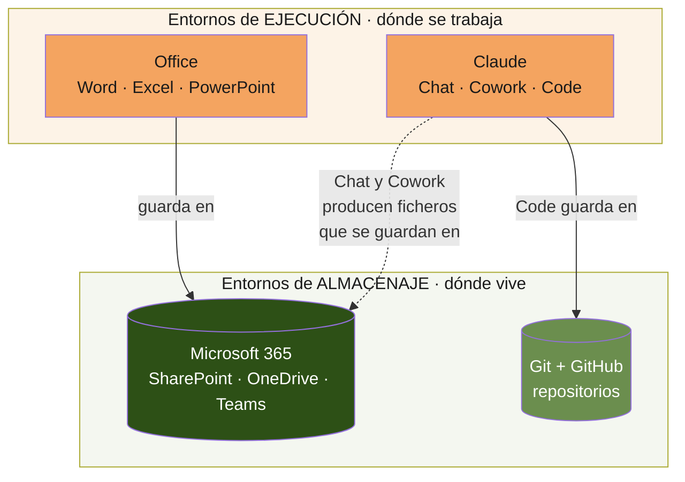
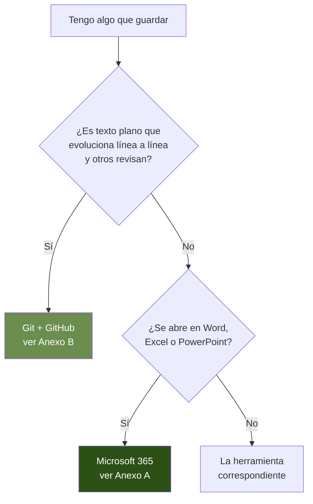

# Entornos digitales de trabajo — T_NEUTRAL

**Documento troncal · Mapa del ecosistema de herramientas**
Este documento explica qué entornos usa T_NEUTRAL, para qué sirve cada uno y cómo se relacionan. Es el punto de entrada: cada entorno tiene además su propio anexo con el detalle práctico.

---

## 1. Para qué sirve este documento

T_NEUTRAL trabaja con varias herramientas, y cada una tiene un papel. Cuando no está claro qué papel cumple cada una ni dónde encaja cada tipo de trabajo, aparecen los problemas de siempre: documentos duplicados, versiones que se pisan, cosas que no se encuentran y trabajo que se rehace.

Este documento es el mapa. No explica cada herramienta en profundidad (eso lo hacen los anexos), sino algo previo y más importante: **qué entornos existen, qué función cumple cada uno y cómo dependen entre sí.** Leerlo da la visión de conjunto necesaria para saber, ante cualquier tarea, a qué entorno pertenece y a qué anexo acudir.

Es un documento vivo. A medida que la empresa adopte nuevas herramientas, se incorporan aquí en el mapa y se les añade su anexo. Hoy cubre tres entornos; mañana serán más.

---

## 2. Dos tipos de entorno: dónde se guarda y dónde se trabaja

Conviene distinguir dos funciones que a veces se confunden:

**Entornos de almacenaje.** Dónde vive un contenido: dónde se guarda, quién puede verlo, cómo se conserva su historial. Responden a la pregunta "¿dónde está esto?".

**Entornos de ejecución.** Dónde se hace un trabajo: dónde se redacta, se calcula, se programa o se razona. Responden a la pregunta "¿dónde hago esto?".

Una misma herramienta puede cumplir las dos funciones o solo una. La confusión habitual nace de tratar todas las herramientas como si fueran cajones de guardar, cuando algunas son mesas de trabajo. El mapa de la sección siguiente las ordena por su función real.

---

## 3. El mapa: los tres entornos actuales

Los tres entornos y su papel:

| Entorno | Función | Para qué |
|---|---|---|
| **Microsoft 365** | Almacenaje (y ejecución de Office) | El trabajo ofimático de todos los días y su archivo: documentos, hojas de cálculo, presentaciones, la comunicación del equipo. |
| **Git + GitHub** | Almacenaje versionado | El texto que evoluciona línea a línea y varias personas revisan: código, configuración, criterios de un modelo, documentación técnica. |
| **Claude** | Ejecución | Donde se razona, redacta, analiza y programa. No guarda: produce, y lo producido se guarda en uno de los otros dos. |

---

## 4. La frontera que decide dónde va cada cosa

La pregunta que resuelve casi todas las dudas de ubicación es una sola: **¿el resultado es texto que evoluciona línea a línea, o un fichero de Office cerrado?**

Código, configuración, criterios de un modelo y documentación técnica en texto van a Git. Memorias, presentaciones, hojas de cálculo y entregables van a Microsoft 365. Claude no aparece en esta decisión porque no guarda: cuando Claude produce algo, ese algo se guarda en Git o en M365 según esta misma frontera.

No se adoptan herramientas nuevas mientras las actuales cubran la necesidad. Cuando una herramienta nueva aporte algo que ninguna de estas da (por ejemplo, diseño visual colaborativo), se incorpora al mapa con su función y su anexo.

---

## 5. Cómo se relacionan: dependencias entre entornos

Los entornos no son islas. Tres relaciones conviene tener presentes:

**Claude ejecuta, los otros guardan.** Claude es el entorno de ejecución. Lo que produce no vive en Claude: un documento generado en Chat o Cowork se guarda en Microsoft 365; un cambio de código o de configuración hecho en Code se guarda en Git. Pensar en Claude como un lugar donde "están" las cosas es el error de partida; Claude es donde se hacen, no donde se quedan.

**Office y Microsoft 365 son la misma casa.** Word, Excel y PowerPoint son las mesas de trabajo; SharePoint, OneDrive y Teams son los cajones. Todo forma parte de Microsoft 365, y por eso un documento de Office guarda con naturalidad en ese entorno. El detalle de qué cajón usar (personal o compartido) es el corazón del Anexo A.

**Code es el puente entre Claude y Git.** De las tres superficies de Claude, solo Code toca directamente un repositorio de Git. Chat y Cowork no. Esta distinción es la que explica por qué ciertos trabajos con Claude requieren tener un repositorio delante y otros no, y se desarrolla en el Anexo C.

---

## 6. Los anexos: el detalle de cada entorno

Este tronco da el mapa. Cada entorno tiene su anexo con el funcionamiento práctico, las reglas de uso y los errores frecuentes:

| Anexo | Entorno | Qué encontrarás |
|---|---|---|
| **Anexo A** | Microsoft 365 | Diferencia entre SharePoint, OneDrive y Teams; qué es personal y qué compartido; higiene documental (nombres, versiones, no duplicar, compartir por enlace). |
| **Anexo B** | Git y GitHub | Qué es un repositorio, un commit, una rama; cómo se sincroniza el trabajo local con la nube; GitHub Desktop. |
| **Anexo C** | Claude | Las tres superficies (Chat, Cowork, Code); los tres niveles de instrucciones; cómo se relacionan con los repositorios. |

Cada anexo se puede leer por separado, según el trabajo de cada persona. No todo el mundo necesita todos: quien solo trabaja con documentos de Office necesita el Anexo A; quien desarrolla o construye bases metodológicas necesita también el B y el C.

---

## 7. Y las guías de trabajo diario

Este documento y sus anexos explican **qué es cada entorno y dónde vive cada cosa**. Es conocimiento de fondo, para consultar.

El **cómo se trabaja cada día** vive en otro sitio: las guías de flujo de trabajo diario, que son operativas y paso a paso. Hay una por cada tipo de trabajo:

- **Guía de trabajo diario con documentos de Office**, para el día a día en Microsoft 365.
- **Guía de trabajo diario Claude/Git**, para desarrollos y bases metodológicas o taxonómicas.

Cada persona acude a la guía que le corresponde según el trabajo que hace. Los entornos se entienden una vez; las guías se siguen a diario.

---

## 8. Punto de partida

Con este tronco leído, cualquier persona del equipo tiene el mapa:

- Sabe que hay entornos de almacenaje (dónde vive) y de ejecución (dónde se trabaja).
- Sabe que Microsoft 365 guarda el trabajo de Office, Git guarda el texto que evoluciona, y Claude ejecuta pero no guarda.
- Sabe decidir, ante cualquier cosa, a qué entorno pertenece.
- Sabe a qué anexo acudir para el detalle, y a qué guía para el día a día.

El siguiente paso es leer el anexo del entorno con el que se vaya a trabajar, y la guía diaria correspondiente.
